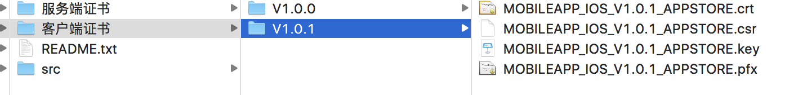
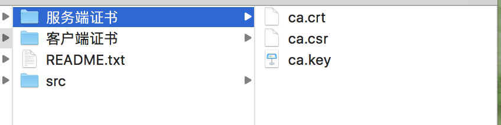

# HTTPS
客户端验证服务端cer证书、客户端p12证书

# 简述
 
简单来说，HTTPS就是HTTP协议上再加一层加密处理的SSL协议,即HTTP安全版。相比HTTP，HTTPS可以保证内容在传输过程中不会被第三方查看、及时发现被第三方篡改的传输内容、防止身份冒充，从而更有效的保证网络数据的安全。
 

[Apple已表示将从2017年1月1日起，所有新提交的App必须强制性应用HTTPS协议来进行网络请求，否则无法上架。](http://www.jianshu.com/p/0109f45395e3)

默认情况下非HTTPS的网络访问是禁止的并且不能再通过简单粗暴的向Info.plist中添加NSAllowsArbitraryLoads设置绕过ATS(App Transport Security)的限制（否则须在应用审核时进行说明并很可能会被拒）。

所以还未进行相应配置的公司需要尽快将升级为HTTPS的事项提上进程了。

主要功能就是将传输的报文进行加密，提高安全性。

# HTTPS 双向认证原理图:

# HTTPS客户端与服务器交互过程：

* 1.客户端第一次请求时，服务器会返回一个包含公钥的数字证书给客户端；

* 2.客户端生成对称加密密钥并用其得到的公钥对其加密后返回给服务器；
* 3.服务器使用自己私钥对收到的加密数据解密，得到对称加密密钥并保存；
* 4.然后双方通过对称加密的数据进行传输。

      HTTPS是工作于SSL层之上的HTTP协议，SSL（安全套接层）工作于TCP层之上，向应用层提供了两个基本安全服务：认证和保密。SSL有三个子协议：握手协议，记录协议和警报协议。其中握手协议实现服务器与客户端的认证与密钥交换，记录协议进行数据加密并保证数据的完整性，警报协议则规定了错误类型和处理机制。

      SSL握手协议包含4个阶段，下面简单介绍每个阶段。

      第一阶段：建立安全能力

        由客户端发起，向服务器发送Client Hello消息，其中包含SSL版本，客户端随机数（用于生成密钥），会话号，加密算法清单，压缩算法清单。

        服务器返回Server Hello消息，其中包含SSL版本，服务器随机数（用于生成密钥），会话号，选择的加密算法，选择的压缩算法。

      第二阶段：服务器认证与密钥交换

      服务器是本阶段所有信息的发送方，共分三步。

        第一步，证书，服务器将服务器数字证书以及整个CA证书链发给客户端，客户端由此获得服务器公钥；客户端还可以在这一步验证服务器是否可信，如果不可信则客户端可以停止连接，并提醒用户注意。

        第二步，证书请求，服务器请求客户端的数字证书，客户端认证在SSL中是可选的，因此这一步也是可选的。

        第三步，服务器握手完成，发送这个消息后，服务器等待客户端响应。

      第三阶段：客户端认证与密钥交换

      客户端是本阶段所有信息的发送方，共分三步。

        第一步，证书，客户端将客户端数字证书发送给服务器，里面包含了客户端的公钥。通常来说这个证书应该是由服务提供者分发给客户端，由指定的CA签发的，因此服务器可以验证客户端证书的合法性，并决定是否继续。

        第二步，密钥交换，客户端生成48字节的预备秘密，用服务器的公钥加密，然后发送给服务器。这个预备秘密只有客户端和服务器才能知道，与双方在之后会话中使用的对称密钥相关。在这一步也间接验证了服务器，服务器必须拥有与证书对应的私钥才能解密预备秘密。

        第三步，证书验证，客户端还需要向服务器验证自己是真正的客户端（数字证书只是证明客户端拥有合法的公钥，但无法证明它就是客户端，拥有与公钥对应的私钥才是关键），为此客户端把预备秘密、客户端随机数和服务器随机数组合起来，用私钥对结果签名，发送给服务器。服务器利用客户端公钥就可以得到原始数据，用以验证客户端的真实性。

      第四阶段：完成

        在这个阶段，客户端和服务器各自独立的生成相同的主秘密和对称密钥，主秘密和对称密钥只有它们自己知道。主秘密和对称密钥由预备秘密、客户端随机数和服务器随机数组合后，经过消息摘要算法生成。

        SSL握手之后就进入会话阶段，客户端和服务器使用握手协议中生成的对称密钥进行加密和解密以保证通信的安全。

# 了解对称加密和非对称加密的区别
* 对称加密只有一个密钥，加密和解密都用这个密钥；
* 非对称加密有公钥和私钥，私钥加密后的内容只有公钥才能解密，公钥加密的内容只有私钥才能解密。

# 数字证书

  在HTTPS客户端与服务器第一次交互时，服务端返回给客户端的数字证书是让客户端验证这个数字证书是不是服务端的，证书所有者是不是该服务器，确保数据由正确的服务端发来，没有被第三方篡改。数字证书可以保证数字证书里的公钥确实是这个证书的所有者(Subject)的，或者证书可以用来确认对方身份。证书由公钥、证书主题(Subject)、数字签名(digital signature)等内容组成。其中数字签名就是证书的防伪标签，目前使用最广泛的SHA-RSA加密。
  
## 证书一般分为两种：

* 一种是向权威认证机构购买的证书，服务端使用该种证书时，因为苹果系统内置了其受信任的签名根证书，所以客户端不需额外的配置。为了证书安全，在证书发布机构公布证书时，证书的指纹算法都会加密后再和证书放到一起公布以防止他人伪造数字证书。而证书机构使用自己的私钥对其指纹算法加密，可以用内置在操作系统里的机构签名根证书来解密，以此保证证书的安全。。

* 另一种是自己制作的证书，使用这类证书的话是不受信任的（当然也不用花钱买），因此需要我们在代码中将该证书设置为信任证书。

# 苹果ATS对HTTPS证书的要求

启用ATS必须符合以下标准，不满足条件的HTTPS证书，ATS都会拒绝连接：

* 服务器所有的连接使用TLS1.2以上版本
* HTTPS证书必须使用SHA256以上哈希算法签名
* HTTPS证书必须使用RSA 2048位或ECC 256位以上公钥算法
* 使用前向加密技术

  此外，苹果ATS支持CT证书透明，要求开发者使用支持CT证书透明度的SSL证书，确保SSL证书合法透明，防止中间人攻击。
  
# 证书提取
 
 从图中可以提取服务端cer证书和客户端p12证书。
 
 ### 具体操作

 
 
 
 * p12证书：将服务器提供的pfx证书双击安装到钥匙串中，再将证书导出成保存client.p12证书，同时会设置相对应的密码。
 
 * cer证书：将crt证书转化为cer证书，执行下面语句 ：
 
        openssl x509 -in 你的证书.crt -out server.cer -outform der 这样你就可以得到cer类型的证书了。

  
# iOS使用自签名证书实现HTTPS请求
   
* 使用AFNetworking进行请求

  AFNetworking首先需要配置AFSecurityPolicy类，AFSecurityPolicy类封装了证书校验的过程。
  
        /**
        AFSecurityPolicy分三种验证模式：
        AFSSLPinningModeNone:只是验证证书是否在信任列表中
        AFSSLPinningModeCertificate：该模式会验证证书是否在信任列表中，然后再对比服务端证书和客户端证书是否一致
        AFSSLPinningModePublicKey：只验证服务端证书与客户端证书的公钥是否一致
        */
        
        
        #import "NetworkManager.h"
        #import <AFNetworking/AFNetworking.h>

        @interface NetworkManager()

        @property(nonatomic,retain)AFHTTPSessionManager * manager;
        @end

        @implementation NetworkManager

        +(instancetype _Nullable)shareHttpManager{
    
            static dispatch_once_t onece = 0;
            static NetworkManager * httpManager = nil;
            dispatch_once(&onece, ^(void){
                httpManager = [[self alloc] init];
            });
            return httpManager;
        }

        -(void)get:(NSString *_Nullable)url withParameters:(id _Nullable )parameters success:(void (^_Nullable)(NSURLSessionDataTask * _Nonnull task,id _Nullable responseObject))success failure:(void (^_Nullable)(NSURLSessionDataTask * _Nonnull task,NSError * _Nonnull error))failure{
    
   
        self.manager = [[AFHTTPSessionManager alloc] initWithBaseURL:[NSURL URLWithString:url]];
        self.manager.responseSerializer = [AFHTTPResponseSerializer serializer];
        self.manager.responseSerializer.acceptableContentTypes = [NSSet setWithObjects:@"application/xml",@"text/html",@"text/xml",@"text/plain",@"application/json",nil];
    
        //    设置超时时间
        [self.manager.requestSerializer willChangeValueForKey:@"timeoutInterval"];
        self.manager.requestSerializer.timeoutInterval = 30.f;
        [self.manager.requestSerializer didChangeValueForKey:@"timeoutInterval"];
    
        [self.manager setSecurityPolicy:[self customSecurityPolicy]];
        [self checkCredential:self.manager];
    

        [self.manager GET:url parameters:parameters progress:nil success:^(NSURLSessionDataTask * _Nonnull task, id  _Nullable responseObject) {
        
            NSHTTPURLResponse *response = (NSHTTPURLResponse *)task.response;
            NSInteger code = response.statusCode;
            NSLog(@"response statusCode is %ld",(long)code);
        
            NSString *message = [[NSString alloc] initWithData:responseObject encoding:NSUTF8StringEncoding];
            NSLog(@"message ========= %@",message);
        
            NSDictionary *responseDic = [self jsonToDictionary:message];
            success(task,responseDic);
        
        } failure:^(NSURLSessionDataTask * _Nullable task, NSError * _Nonnull error) {
            NSHTTPURLResponse *response = (NSHTTPURLResponse *)task.response;
            NSInteger code = response.statusCode;
            NSLog(@"response statusCode is %ld",(long)code);
            failure(task,error);
        }];
    
      }

        - (AFSecurityPolicy*)customSecurityPolicy {
    
            // 安全验证
            //AFSSLPinningModeCertificate: 代表客户端会将服务器端返回的证书和本地保存的证书中的所有内容，包括PublicKey和证书部分，全部进行校验；如果正确，才继续进行。
    
            NSString * cerPath = [[NSBundle mainBundle] pathForResource:@"server" ofType:@"cer"];
            NSData * cerData = [NSData dataWithContentsOfFile:cerPath];
            NSCAssert(cerData != nil, @"cerData is nil");
    
            //服务器端证书由AFSecurityPolicy 读取
            AFSecurityPolicy * securityPolicy = [AFSecurityPolicy policyWithPinningMode:AFSSLPinningModeCertificate withPinnedCertificates:[[NSSet alloc] initWithObjects:cerData, nil]];
    
            //是否允许使用自签名证书
            securityPolicy.allowInvalidCertificates=YES;
            //是否需要验证域名
            securityPolicy.validatesDomainName=NO;
    
            return securityPolicy;
        }

        //校验证书
        - (void)checkCredential:(AFURLSessionManager *)manager {

            //关闭缓存避免干扰测试
            self.manager.requestSerializer.cachePolicy = NSURLRequestReloadIgnoringLocalCacheData;
            [self.manager setSessionDidBecomeInvalidBlock:^(NSURLSession * _Nonnull session, NSError * _Nonnull error) {
            NSLog(@"setSessionDidBecomeInvalidBlock");
        }];
    
        //客服端请求验证 重写 setSessionDidReceiveAuthenticationChallengeBlock 方法
        __weak typeof(self) weakSelf = self;
        [self.manager setSessionDidReceiveAuthenticationChallengeBlock:^NSURLSessionAuthChallengeDisposition(NSURLSession * _Nonnull session, NSURLAuthenticationChallenge * _Nonnull challenge, NSURLCredential *__autoreleasing  _Nullable * _Nullable credential) {
        
        
        NSURLSessionAuthChallengeDisposition disposition = NSURLSessionAuthChallengePerformDefaultHandling;
        
        __autoreleasing NSURLCredential *cdt = nil;
        
        //判断服务器要求客户端的接收认证挑战方式，如果是NSURLAuthenticationMethodServerTrust则表示去检验服务端证书是否合法，NSURLAuthenticationMethodClientCertificate则表示需要将客户端证书发送到服务端进行检验
        if ([challenge.protectionSpace.authenticationMethod isEqualToString:NSURLAuthenticationMethodServerTrust]) {
            
            NSLog(@"服务端证书认证！");
            // 基于客户端的安全策略来决定是否信任该服务器，不信任的话，也就没必要响应挑战
            if ([weakSelf.manager.securityPolicy evaluateServerTrust:challenge.protectionSpace.serverTrust forDomain:challenge.protectionSpace.host]) {
                
                 // 创建挑战证书（注：挑战方式为UseCredential和PerformDefaultHandling都需要新建挑战证书）
                cdt = [NSURLCredential credentialForTrust:challenge.protectionSpace.serverTrust];
                
                // 确定挑战的方式
                if (cdt) {
                    //证书挑战  设计policy,none，则跑到这里
                    disposition = NSURLSessionAuthChallengeUseCredential;
                } else {
                    disposition = NSURLSessionAuthChallengePerformDefaultHandling;
                }
                
            } else {
                //取消挑战 整个请求将被取消,凭证参数被忽略
                NSLog(@"不是服务器信任的证书-没有挑战的必要了");
                disposition = NSURLSessionAuthChallengeCancelAuthenticationChallenge;
            }
            
        }
        else//只有双向认证才会走这里
        {
            // client authentication
            //disposition = NSURLSessionAuthChallengePerformDefaultHandling;
            
            //p12数据中提取identity和trustobjects（可信任对象），并评估其可信度。
            SecIdentityRef identity = NULL;
            //评估证书。这里的信任对象（trustobject），包括信任策略和其他用于判断证书是否可信的信息，都已经含在了PKCS数据中。要单独评估一个证书是否可信
            SecTrustRef trust = NULL;
            NSString *p12 = [[NSBundle mainBundle] pathForResource:@"client"ofType:@"p12"];
            NSFileManager *fileManager =[NSFileManager defaultManager];
            
            if(![fileManager fileExistsAtPath:p12])
            {
                NSLog(@"客户端证书不存在！");
            }
            else
            {
                NSData *PKCS12Data = [NSData dataWithContentsOfFile:p12];
                
                if ([[weakSelf class] extractIdentity:&identity andTrust:&trust fromPKCS12Data:PKCS12Data])
                {
                    NSLog(@"加载客户端证书成功");
                    SecCertificateRef certificate = NULL;
                    SecIdentityCopyCertificate(identity, &certificate);
                    const void*certs[] = {certificate};
                    CFArrayRef certArray =CFArrayCreate(kCFAllocatorDefault, certs,1,NULL);
                    cdt =[NSURLCredential credentialWithIdentity:identity certificates:(__bridge NSArray*)certArray persistence:NSURLCredentialPersistencePermanent];
                    disposition =NSURLSessionAuthChallengeUseCredential;
                }
            }
            
        }
        
        *credential = cdt;
        
        return disposition;
        }];
      }

        //读取p12文件中的密码
        +(BOOL)extractIdentity:(SecIdentityRef *)outIdentity andTrust:(SecTrustRef*)outTrust fromPKCS12Data:(NSData *)inPKCS12Data
        {
            OSStatus securityError =errSecSuccess;
            //client certificate password
            //构造包含了密码的dictionary，用于传递给SecPKCS12Import函数。注意这里使用的是core foundation中的CFDictionaryRef，与NSDictionary完全等价
            NSDictionary *optionsDictionary = [NSDictionary dictionaryWithObject:@"123456"forKey:(id)kSecImportExportPassphrase];
            CFArrayRef items =CFArrayCreate(NULL,0, 0,NULL);
            securityError = SecPKCS12Import((CFDataRef)inPKCS12Data,(CFDictionaryRef)optionsDictionary,&items);
            if (securityError ==0) {
                CFDictionaryRef myIdentityAndTrust =CFArrayGetValueAtIndex (items, 0);
                const void *tempIdentity = NULL;
                tempIdentity = CFDictionaryGetValue (myIdentityAndTrust,kSecImportItemIdentity);
                *outIdentity = (SecIdentityRef)tempIdentity;
                const void *tempTrust = NULL;
                tempTrust = CFDictionaryGetValue (myIdentityAndTrust,kSecImportItemTrust);
                *outTrust = *(SecTrustRef*)tempTrust;
        } else {
                NSLog(@"--------证书错误------- %d",(int)securityError);
                return NO;
        }
            return YES;
        }

        - (NSDictionary *)jsonToDictionary:(NSString *)jsonString {
            NSData *jsonData = [jsonString dataUsingEncoding:NSUTF8StringEncoding];
            NSError *jsonError;
            NSDictionary *resultDic = [NSJSONSerialization JSONObjectWithData:jsonData options:NSJSONReadingMutableLeaves error:&jsonError];
            
            return resultDic;
        }

        @end

  上述代码通过给AFHTTPSessionManager重新设置证书验证回调来自己验证证书，然后将自己的证书加入到可信任的证书列表中，即可通过证书的校验。
  
  # 实例调用
   
      NSString*baseUrl = @"https://121.201.15.188:11443";
      NetworkManager *httpManager = [NetworkManager shareHttpManager];
      [httpManager post:baseUrl withParameters:nil success:^(NSURLSessionDataTask *task, id responseObject) {
          NSLog(@" ===== success ===== ");
      } failure:^(NSURLSessionDataTask *task, NSError *error) {
          NSLog(@" ===== failure ===== %@",error);
      }];
